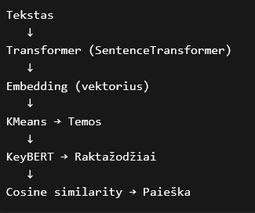
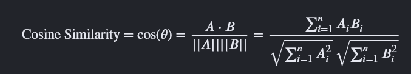

# Paieskos-algoritmas
LD1. Paieškos algoritmų tyrimas

Ši sistema naudoja dirbtinio intelekto pagrindu veikiančius teksto embedding modelius straipsnių analizei ir paieškai. Naudojant SentenceTransformer modelį straipsniai paverčiami į vektorius, o KMeans algoritmas suskirsto juos į 5 temines grupes. Raktažodžiai išgaunami naudojant KeyBERT, kuris remiasi transformer architektūra ir semantiniu panašumu. Sistema leidžia vartotojui atlikti semantinę paiešką pagal įvestą frazę, naudojant cosine similarity metodą. Vartotojo sąsaja sukurta naudojant Streamlit.

### Neitraukiami dataset ir artifact failai, dėl failų dydžio limito (100MB)

## Visa sistema

Sistema atlieka 3 pagrindinius procesus:

1. Teksto pavertimas į skaitinę formą (embedding)
2. Tekstų sugrupavimas pagal semantinį panašumą (KMeans)
3. Semantinė paieška pagal vartotojo įvestą frazę

# SentenceTransformer 

Įvertina, kurie žodžiai sakinyje yra svarbiausi ir supranta kontekstą.

# Embedding - didelis vektorius, kuris atspindi teksto semantinę prasmę.

Pvz.
Straipsnis → [0.13, -0.22, 0.91, ..., 0.004]

Du panašios prasmės tekstai turės panašius vektorius, o skirtingi tekstai bus toli vienas nuo kito vektorinėje erdvėje.

# KMeans - temų grupavimas

Kaip tai veikia:

1. Parenkami K atsitiktiniai centroidai (pvz. 5)
2. Kiekvienas straipsnio embedding’as priskiriamas artimiausiam centroidui
3. Centroidai perskaičiuojami kaip klasterio vidurkis
4. Procesas kartojamas

Rezultatas - Straipsniai su panašia prasme atsiduria toje pačioje temoje. Temos atsiranda automatiškai (unsupervised learning).

# KeyBERT - raktažodžių išgavimas

Procesas:

1. Straipsnio tekstas → embedding
2. Sugeneruojamos galimos frazės (1–2 žodžių kombinacijos)
3. Kiekviena frazė → embedding
4. Skaičiuojamas cosine similarity tarp viso dokumento embedding ir frazės embedding

Raktažodis yra tas, kuris geriausiai semantiškai atspindi dokumentą.

# Kaip veikia paieška

Kai vartotojas įveda frazę:

1. Frazė → embedding
2. Skaičiuojamas cosine similarity su visais straipsnių embedding’ais
3. Grąžinami top N artimiausi

| Similarity | Interpretacija      |
| ---------- | ------------------- |
| 0.8–1.0    | Labai panašu        |
| 0.6–0.8    | Panašu              |
| 0.4–0.6    | Vidutiniškai susiję |
| 0–0.4      | Silpnai susiję      |
| <0         | Nesusiję            |

