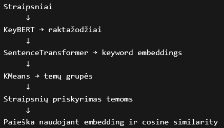
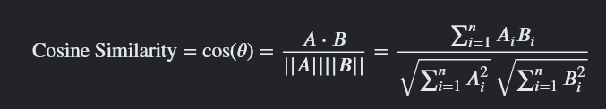

# Paieskos-algoritmas
LD1. Paieškos algoritmų tyrimas

Ši sistema naudoja dirbtinio intelekto pagrindu veikiančius teksto embedding modelius straipsnių analizei ir paieškai. Naudojant KeyBERT iš straipsnių teksto išgaunami svarbiausi raktažodžiai, kurie paverčiami į vektorius naudojant SentenceTransformer modelį. Tuomet KMeans algoritmas sugrupuoja raktažodžius į 5 temines grupes, o straipsniai priskiriami temoms pagal jų raktažodžių atitikimą. Sistema leidžia vartotojui atlikti semantinę paiešką pagal įvestą frazę, naudojant cosine similarity metodą tarp embedding vektorių. Vartotojo sąsaja sukurta naudojant Streamlit.

### Neitraukiami dataset ir artifact failai, dėl failų dydžio limito (100MB)

## Visa sistema

Sistema atlieka 3 pagrindinius procesus:

1. Teksto pavertimas į skaitinę formą (embedding)
2. Tekstų sugrupavimas pagal semantinį panašumą (KMeans)
3. Semantinė paieška pagal vartotojo įvestą frazę

# SentenceTransformer 

SentenceTransformer yra transformer architektūros modelis, kuris tekstą paverčia į skaitinę reprezentaciją – embedding.

Modelis įvertina:

- kurie žodžiai sakinyje yra svarbiausi

- žodžių tarpusavio kontekstą

Tai leidžia modeliui suprasti teksto prasmę, o ne tik žodžių sutapimą.

# Embedding - didelis vektorius, kuris atspindi teksto semantinę prasmę.

Pvz.
Straipsnis → [0.13, -0.22, 0.91, ..., 0.004]

Du panašios prasmės tekstai turės panašius vektorius, o skirtingi tekstai bus toli vienas nuo kito vektorinėje erdvėje.

# KeyBERT - raktažodžių išgavimas

KeyBERT naudoja transformer modelį tam, kad iš teksto išgautų svarbiausias frazes.

Procesas:

1. Straipsnio tekstas paverčiamas į embedding

2. Sugeneruojamos galimos frazės (1–2 žodžių kombinacijos)

3. Kiekviena frazė taip pat paverčiama į embedding

4. Skaičiuojamas cosine similarity tarp dokumento embedding ir frazės embedding

Frazės, kurios turi didžiausią panašumą su dokumentu, laikomos raktažodžiais.

# KMeans - raktažodžių grupavimas į temas

Iš visų straipsnių surenkami raktažodžiai ir paverčiami į embedding'us.

Tada naudojamas KMeans klasterizacijos algoritmas, kuris sugrupuoja raktažodžius į K temų.

Kaip tai veikia:

1. Parenkami K atsitiktiniai centroidai (pvz. 5)

2. Kiekvienas raktažodžio embedding’as priskiriamas artimiausiam centroidui

3. Centroidai perskaičiuojami kaip klasterio vidurkis

4. Procesas kartojamas kol klasteriai stabilizuojasi

Rezultatas – raktažodžiai suskirstomi į temines grupes.

# Kaip veikia paieška

Kai vartotojas įveda frazę:

1. Frazė → embedding
2. Skaičiuojamas cosine similarity tarp frazės embedding ir visų straipsnių embedding
3. Straipsniai surikiuojami pagal panašumą
4. Grąžinami labiausiai panašūs rezultatai

| Similarity | Interpretacija      |
| ---------- | ------------------- |
| 0.8–1.0    | Labai panašu        |
| 0.6–0.8    | Panašu              |
| 0.4–0.6    | Vidutiniškai susiję |
| 0–0.4      | Silpnai susiję      |
| <0         | Nesusiję            |

